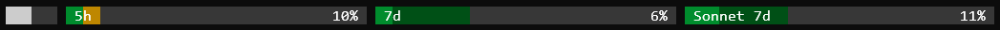

# Claude Code Status Limits

A status bar script for [Claude Code](https://claude.ai/code) that visualizes context window usage and rate limit consumption in real time.



[Русская версия](README.ru.md)

## What it shows

### Context bar

Shows how full the current conversation context window is. Claude Code reserves a fixed 33k-token autocompact buffer and automatically compresses the conversation history when that threshold is reached. The buffer percentage depends on the context window size: ~16.5% for 200k, ~3.3% for 1M.

The bar scales to the usable portion of the window, so it reaches 100% exactly when autocompact is about to trigger. If the context has already entered the buffer zone, the bar turns **amber**.

### Rate limit bars

Each bar represents a usage quota within a fixed time window — either 5 hours or 7 days. The bar label and current percentage are shown as text inside the bar.

#### Reading the colors

Every rate limit bar encodes two things at once: how much of the quota has been consumed, and how far through the reset window you are. The color tells you which of the two is ahead of the other:

**Bright green** — consumption and time are both progressing normally. Nothing to worry about.

**Dark green** — you have used little of the quota relative to how much time has passed. You are well within the limit and have room to spare.

**Amber** — you are consuming the quota faster than time is passing. At this pace you are likely to hit the limit before the window resets.

**Dark gray** — no data yet, or the window just opened.

## Data sources

The script receives data from two independent sources.

**Claude Code itself** passes context window fill and the 5h/7d rate limit state after each turn. These values are only available once the conversation has started, so the very first render of a new chat relies on cached data from the previous session.

**The Claude.ai usage API** provides per-model quotas such as Sonnet 7d, Opus 7d, and others. It is queried using the OAuth token that Claude Code itself uses to authenticate, so no separate credentials are needed. The API is refreshed at most once every 5 minutes.

## Caching

The last known state of every bar is saved to `~/.claude/status_limits_cache.json`. This means bars always show something meaningful even at the start of a fresh chat, before any turn data has come in. As new data arrives — from Claude Code or from the API — the cache is updated, and the two sources are merged: when they overlap, the live Claude Code data takes priority over the API.

## Setup

Add the following to `~/.claude/settings.json`:

```json
"statusLine": {
  "type": "command",
  "command": "python /path/to/claude-code-status-limits/status_limits.py"
}
```

Adjust the path to wherever you cloned the repository. Python 3.10+ and `curl` are required.

### Bar width

Claude Code places other content (such as a token counter) to the right of the status bar output, so the bars never occupy the full terminal width. By default the script renders at 120 columns. To control how wide the bar strip is, pass the desired width as an argument:

```json
"command": "python /path/to/claude-code-status-limits/status_limits.py 100"
```

Adjust the value until the bars fit the available space in your terminal.
